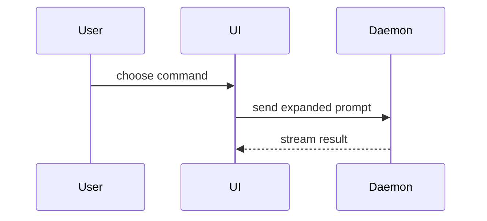

使用以下模板撰写 PR 正文：

```markdown
## Summary

<diagram, diff-sketch, or tree>

## Evidence

- **Before:** <screenshot/output/failing test run>
  **After:** <screenshot/output/passing test run>

## Merge Danger

**Door:** <one-way or two-way>

<optional: description>

**Blast Radius:** <one-word description>

<optional: potential ramifications of merge>
```

## Sections

跳过所有开场白，保持文字简短。使用 `CONTEXT.md` 中用户所在领域的语言。

### Summary

选择能清楚表达要点的最小视图。

- 使用伪代码展示逻辑或算法：

```text
on(save)
  if content is unchanged
    return cached result
  write new content
  return fresh result
```

- 使用调用树展示运行时控制流：

```text
submitForm
  createSession
    persistPrompt
    launchAgent
  navigateToSession
```

- 使用组件树展示 UI 结构，并包含重要的状态与模块边界：

```tsx
<SessionPage>(apps / example / src / routes / session.tsx);
useSessionEvents() < SessionToolbar > <RunSkillButton>(packages / ui);
```

- 使用浅层文件树展示文件职责或大范围重构：

```text
src/
├── commands/       # parses user actions
├── sessions/       # owns session state
└── transport/      # sends API requests
```

- 使用 Mermaid 展示组件交互、控制流或数据流：



- 当要点在于具体变化，而周边结构已经存在时，使用 `diff`。让 diff 的形状匹配主题。

对于组件变更：

```diff
 <SessionPage>
   useSessionEvents()
   <SessionToolbar>
+    <RunSkillButton />
   <SessionTimeline>
+    <SkillResultCard />
```

对于文件布局变更：

```diff
 src/
 ├── commands/
+│   └── show-me.ts       # expands the slash command
 ├── sessions/
-└── transport.ts
+└── transport/
+    ├── client.ts
+    └── stream.ts
```

对于调用树或调用栈变更：

```diff
 submitForm
   createSession
     persistPrompt
+    expandSkillMention
     launchAgent
-  navigateToSession
+  navigateToSession
+    subscribeToEvents
```

对于状态或控制流变更：

```diff
 on(save)
-  write content
+  if content is unchanged
+    return cached result
+  write new content
+  invalidate cache
```

- 当大部分内容都是新的、省略上下文会掩盖职责或顺序，或者用户需要一个可复制的目标形状时，展示完整代码块：

```ts
function expandSkill(command: string): string {
  const skillName = command.slice(1);
  return `use the ${skillName} skill`;
}
```

#### Guidance

把每个可视化放在它所支持的简短文字旁边。只保留回答用户当前问题或解决当前讨论点所需的调用、文件、props、状态和边界。

你可以使用其中一种，也可以使用多种，但通常不太可能全部使用。请自行判断，不要让用户承受过多信息。

### Evidence

提供能证明变更有效的具体证据，并展示 before 和 after。

如果环境已准备好且变更涉及视觉效果，截图是 S-tier 证据。

执行结果是 A-tier 证据，例如测试结果、console output。使用伪代码展示现在会失败和会通过的准确测试。

### Merge Danger

说明这是 one-way door 还是 two-way door。two-way door 可以退回，但 one-way door 不行。回滚成本低的 PR 风险更低。涉及破坏性操作或难以逆转决策的变更属于 one-way door。

Blast Radius 是这个 PR 引入的变更可能造成的影响或作用范围。考虑所有可能性，例如 layout shift、consumer breakage、mobile responsiveness 等。
